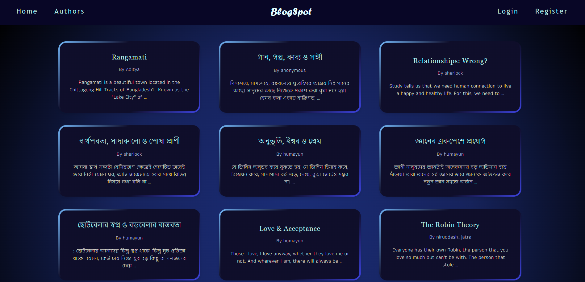
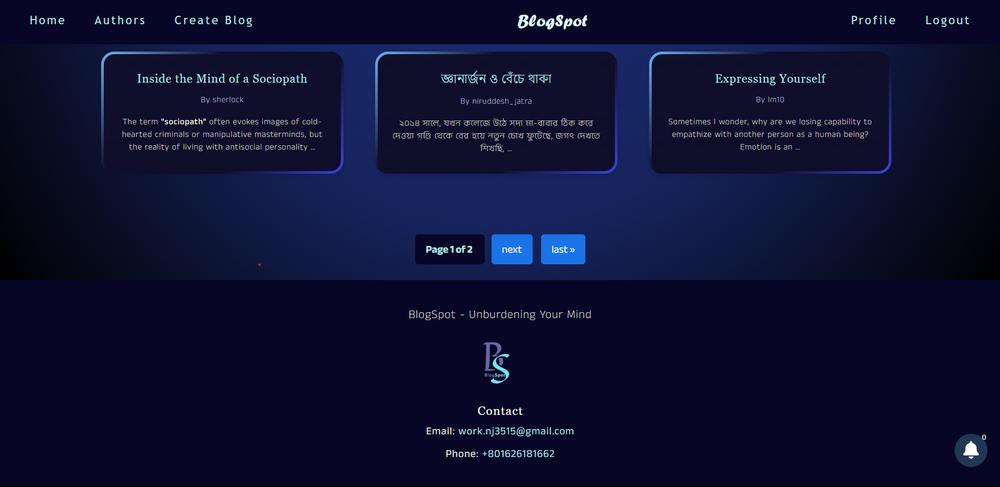
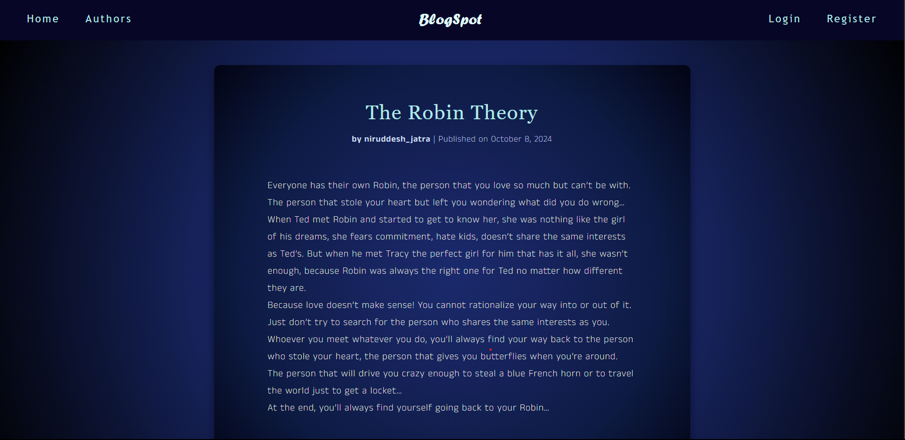
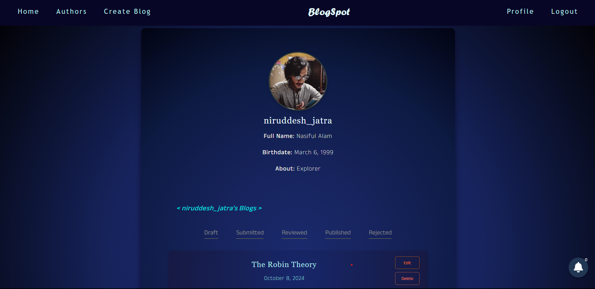
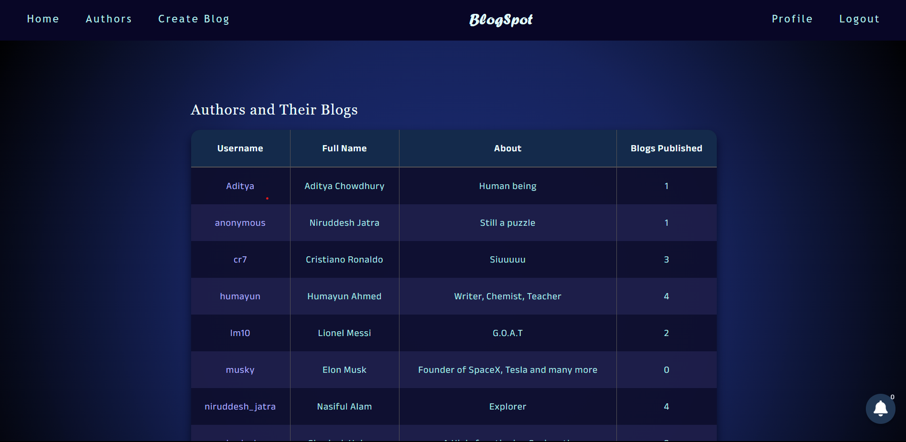
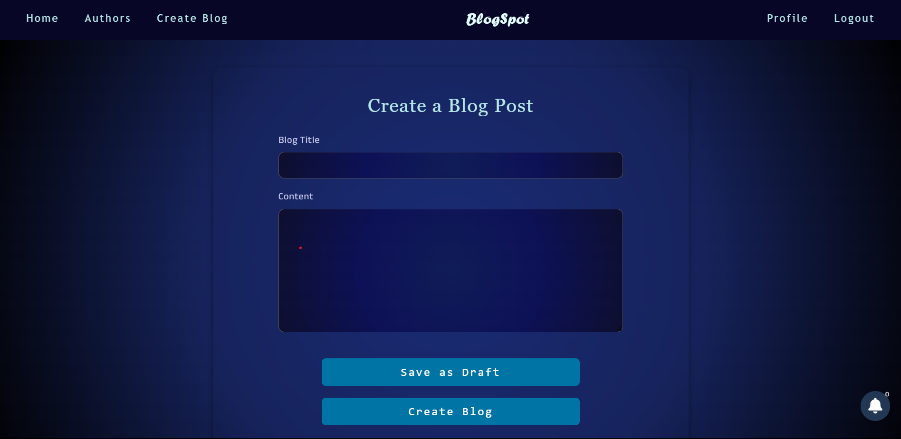
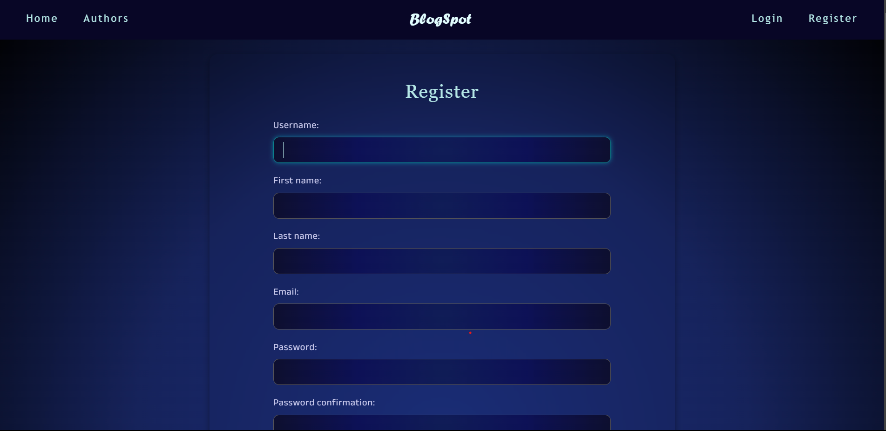

# BlogSpot

BlogSpot is a web application that allows users to post, read, and manage blogs. It provides a platform for users to share their thoughts and unburden their minds. The application features user authentication, profile management, and a notification system for blog status updates.

## Table of Contents

- [Features](#features)
- [Technologies Used](#technologies-used)
- [Directory Structure](#directory-structure)
- [Setup Instructions](#setup-instructions)
- [Usage](#usage)
- [License](#license)

## Features

- User registration and authentication
- Create, edit, and delete blogs
- View published blogs
- Author profiles with blog counts
- Notification system for blog status updates
- Responsive design for mobile and desktop users

## Technologies Used

- **Django**: A high-level Python web framework for rapid development.
- **MySQL**: A relational database management system used for data storage.
- **HTML/CSS/JavaScript**: For front-end development.
- **Font Awesome**: For icons and improved UI aesthetics.

## Directory Structure

```plaintext
├───Blogapp
│   ├───migrations
│   │   └───__pycache__
│   ├───templates
│   └───__pycache__
├───BlogSpot
│   └───__pycache__
├───media
│   └───profiles
├───static
│   ├───css
│   ├───images
│   └───js
└───templates
```

### Key Files

- **`base.html`**: The main template that includes the structure of the web pages, including navigation and footer.
- **`home.html`**: Displays a list of blogs with pagination.
- **`views.py`**: Contains the view functions for rendering templates and handling user requests.
- **`models.py`**: Defines the data models for the application, including `Profile`, `Blog`, and `Notification`.
- **`admin.py`**: Configures the admin interface for managing blogs and user profiles.

## Screenshots









## Setup Instructions

1. **Clone the Repository**:
   ```bash
   git clone https://github.com/NiruddeshJatra/BlogSpot.git
   cd BlogSpot
   ```

2. **Create a Virtual Environment**:
   ```bash
   python -m venv .venv
   ```

3. **Activate the Virtual Environment**:
   - **Windows**:
     ```bash
     .venv\Scripts\activate
     ```
   - **Linux/macOS**:
     ```bash
     source .venv/bin/activate
     ```

4. **Install Dependencies**:
   Ensure you have a `requirements.txt` file and run:
   ```bash
   pip install -r requirements.txt
   ```

5. **Setup the Database**:
   Configure your database settings in `settings.py`, then run:
   ```bash
   python manage.py migrate
   ```

6. **Create a Superuser** (for admin access):
   ```bash
   python manage.py createsuperuser
   ```

7. **Run the Development Server**:
   ```bash
   python manage.py runserver
   ```

8. **Access the Application**:
   Open your browser and go to `http://127.0.0.1:8000`.

## Usage

- **Register**: Create an account to start posting blogs.
- **Login**: Access your account and manage your profile.
- **Create Blog**: Write and submit new blogs.
- **View Blogs**: Explore published blogs from various authors.
- **Profile Management**: View your profile and the blogs you've written.

## License

This project is licensed under the MIT License. See the [LICENSE](LICENSE) file for more details.
